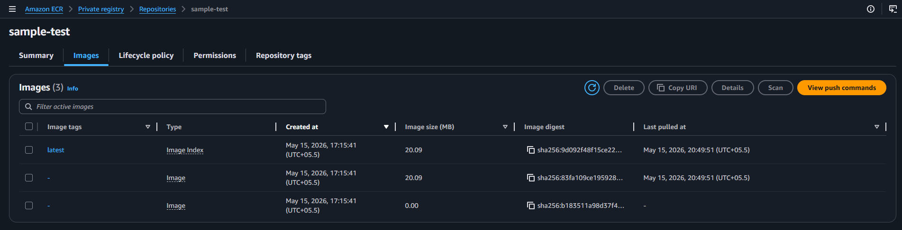
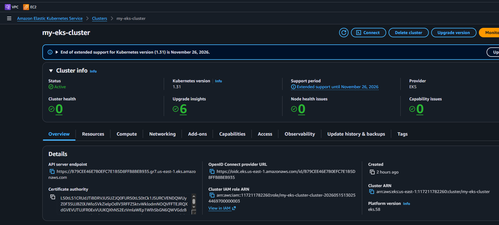
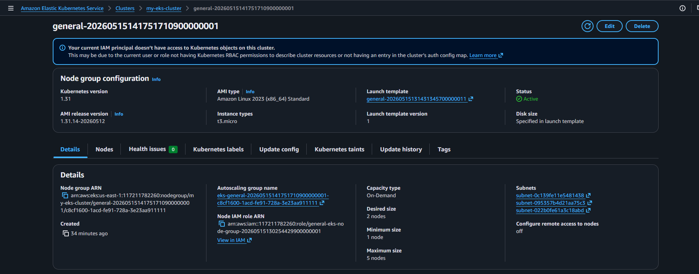
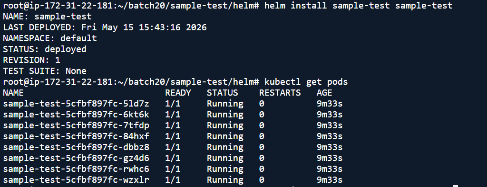
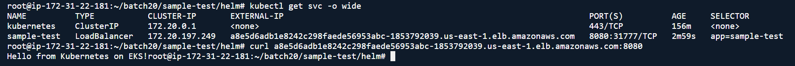
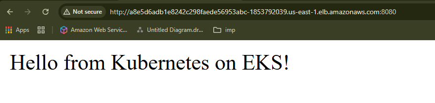

### Kubernetes Deployment Exercise — End-to-End DevOps Implementation

# Required Tools
1.	AWS EKS → Kubernetes Cluster
2.	Terraform → Infrastructure as Code
3.	Docker → Containerization
4.	AWS ECR → Container Registry
5.	Helm → Kubernetes Packaging & Deployment
6.	HPA → Autoscaling
7.	PriorityClass → Higher priority than DaemonSets
8.  RollingUpdate Strategy → Ensure minimum 5 pods always running


====================
```sh
Architecture Overview
Developer
   |
   | Docker Build
   v
AWS ECR (sample-test:latest)
   |
   | Helm Deploy
   v
AWS EKS Cluster
   |
   | Deployment (8 replicas)
   | HPA (CPU 50%, Memory 60%)
   | Service (LoadBalancer)
   v
AWS ELB
```
=====================

# STEP 1 — Create Simple Application

* We need a simple HTTP web server.

* We’ll use Python Flask because:

 * Very lightweight
 * Easy to understand
 * Fast to deploy


## Create Project Structure
* sample-test/
    * application/
       * sample-test applicaiton 
       
    * terraform/
        * create EKS cluster

    * helm/
       * sample-test helm chart to deploy on EKS


## Create Flask App
* app.py

```sh
from flask import Flask

app = Flask(__name__)

@app.route("/")
def hello():
    return "Hello from Kubernetes on EKS!"

if __name__ == "__main__":
    app.run(host="0.0.0.0", port=8080)
```
-----------------------------------------------------


* Requirements File requirements.txt

```sh
flask==3.0.0
gunicorn==21.2.0
```


# STEP 2 — Create Multi-Stage Dockerfile

* WHY Multi-stage?

* Without multi-stage:

  * Bigger image
  * More vulnerabilities
  * Slower deployments

* With multi-stage:

  * Smaller image
  * Faster pull time
  * Better security

-----------------------------------------

## multi-stage Dockerfile
=============================
```sh
# -------------------------
# Stage 1 - Builder
# -------------------------
FROM python:3.12-slim AS builder

WORKDIR /app

COPY requirements.txt .

RUN pip install --no-cache-dir --user -r requirements.txt

# -------------------------
# Stage 2 - Runtime
# -------------------------
FROM python:3.12-alpine

WORKDIR /app

COPY --from=builder /root/.local /root/.local

COPY app.py .

ENV PATH=/root/.local/bin:$PATH

EXPOSE 8080

CMD ["gunicorn", "-b", "0.0.0.0:8080", "app:app"]
```
============================================================

## install docker 
link -[https://docs.docker.com/engine/install/ubuntu/]

* docker .sh
----------------
```sh 
# Add Docker's official GPG key:
sudo apt update
sudo apt install ca-certificates curl
sudo install -m 0755 -d /etc/apt/keyrings
sudo curl -fsSL https://download.docker.com/linux/ubuntu/gpg -o /etc/apt/keyrin>
sudo chmod a+r /etc/apt/keyrings/docker.asc

# Add the repository to Apt sources:
sudo tee /etc/apt/sources.list.d/docker.sources <<EOF
Types: deb
URIs: https://download.docker.com/linux/ubuntu
Suites: $(. /etc/os-release && echo "${UBUNTU_CODENAME:-$VERSION_CODENAME}")
Components: stable
Architectures: $(dpkg --print-architecture)
Signed-By: /etc/apt/keyrings/docker.asc
EOF

sudo apt update
sudo apt install docker-ce docker-ce-cli containerd.io docker-buildx-plugin doc>
sudo systemctl start docker
sudo systemctl enable docker
```

# STEP 3 — Build Docker Image

* Build Image

```sh
docker build -t sample-test:latest 
```
------------------------------------------------------

## install awscli

[https://docs.aws.amazon.com/cli/latest/userguide/getting-started-install.html] 

# STEP 4 — Push Image to AWS ECR
* Create ECR Repository


```sh
aws ecr create-repository \
    --repository-name sample-test \
    --region us-east-1
```
* Login to ECR 
* Docker must authenticate before pushing.
* This command authenticates your local Docker CLI to your private Amazon ECR registry so you can push and pull images.
* aws ecr get-login-password: Calls the AWS CLI to retrieve a temporary, 12-hour authorization token.| (The Pipe): Passes that token directly to the next command without displaying it on your screen or saving it in your shell history.docker login: Uses the token (via --password-stdin) to log in to your specific AWS account's registry URL.

```sh
aws ecr get-login-password --region us-east-1 | \
docker login --username AWS \
--password-stdin 117211782260.dkr.ecr.us-east-1.amazonaws.com
```

* Tag Image

```sh 
docker tag sample-test:latest \
117211782260.dkr.ecr.us-east-1.amazonaws.com/sample-test:latest
```
==========================

* Push Image

```sh 
docker push \
117211782260.dkr.ecr.us-east-1.amazonaws.com/sample-test:latest
```


====================================
# STEP 4 create eks cluster using terraform
* create file ekscluster.tf
* using aws default modules to create eks cluster

```sh
#aws vpc module
module "vpc" {
  source  = "terraform-aws-modules/vpc/aws"
  version = "~> 5.0"

  name = "eks-vpc"
  cidr = "10.0.0.0/16"

  azs             = ["us-east-1a", "us-east-1b", "us-east-1c"]
  private_subnets = ["10.0.1.0/24", "10.0.2.0/24", "10.0.3.0/24"]
  public_subnets  = ["10.0.101.0/24", "10.0.102.0/24", "10.0.103.0/24"]

  enable_nat_gateway = true
  single_nat_gateway = true

  public_subnet_tags = {
    "kubernetes.io/role/elb" = "1"
  }

  private_subnet_tags = {
    "kubernetes.io/role/internal-elb" = "1"
  }
}


# aws eks module
module "eks" {
  source  = "terraform-aws-modules/eks/aws"
  version = "~> 20.0"

  cluster_name    = "my-eks-cluster"
  cluster_version = "1.31"

  # Networking
  vpc_id     = module.vpc.vpc_id
  subnet_ids = module.vpc.private_subnets

  # Public access endpoint (for kubectl access from your machine)
  cluster_endpoint_public_access = true

  # Managed Node Groups
  eks_managed_node_groups = {
    general = {
      desired_size = 2
      min_size     = 1
      max_size     = 3

      instance_types = ["t3.micro"]
      capacity_type  = "ON_DEMAND"
    }
  }

  # Enable cluster creator admin permissions automatically
  enable_cluster_creator_admin_permissions = true
}
```
## install terraform
```sh
curl -O https://releases.hashicorp.com/terraform/1.15.3/terraform_1.15.3_linux_amd64.zip
unzip terraform_1.15.3_linux_amd64.zip 
mv terraform /bin/terraform
terraform --version
```
```sh
terraform init   #initiate provider and backend
terraform plan   # check what is going to be create on aws
terraform apply  # create all that you see in plan
```

* *IT will take 30min or more to create aws eks cluster*
* after creation take access of the eks cluster


### Take access of EKS cluster
```sh
aws eks update-kubeconfig --region us-east-1 --name my-eks-cluster
```
* To work on cluster install kubectl

```sh 
sudo snap install kubectl --classic
```
```sh
/helm/sample-test# kubectl get nodes 
NAME                         STATUS   ROLES    AGE   VERSION
ip-10-0-1-198.ec2.internal   Ready    <none>   47m   v1.31.14-eks-7fcd7ec
ip-10-0-2-250.ec2.internal   Ready    <none>   47m   v1.31.14-eks-7fcd7ec
```


# STEP 5 install Helm 
- we are deploying application using helm chart on eks cluster
* helm is the package manager for kubernetes
```sh
sudo apt-get install curl gpg apt-transport-https --yes
curl -fsSL https://packages.buildkite.com/helm-linux/helm-debian/gpgkey | gpg --dearmor | sudo tee /usr/share/keyrings/helm.gpg > /dev/null
echo "deb [signed-by=/usr/share/keyrings/helm.gpg] https://packages.buildkite.com/helm-linux/helm-debian/any/ any main" | sudo tee /etc/apt/sources.list.d/helm-stable-debian.list
sudo apt-get update
sudo apt-get install helm
```

## create helm chart

```sh 
helm create sample-test 
```

* Remove unnecessary templates.

* Final Helm Structure
* helm/sample-test/
 *  Chart.yaml
 *  values.yaml
 *  templates/
    * deployment.yaml
    * service.yaml
    * hpa.yaml
    * priorityclass.yaml

## Define Helm Values
### values.yaml
```sh
replicaCount: 8

image:
  repository: <ACCOUNT_ID>.dkr.ecr.us-east-1.amazonaws.com/sample-test
  tag: latest

service:
  type: LoadBalancer
  port: 8080

resources:
  requests:
    cpu: "200m"
    memory: "256Mi"

  limits:
    cpu: "500m"
    memory: "512Mi"

autoscaling:
  minReplicas: 8
  maxReplicas: 15
  targetCPUUtilizationPercentage: 50
  targetMemoryUtilizationPercentage: 60
  ```
### Create PriorityClass

* Requirement: *Pods should have higher priority than DaemonSet pods*.

* DaemonSets typically run with default priority.

* We create higher priority.

* templates/priorityclass.yaml
```sh 
apiVersion: scheduling.k8s.io/v1
kind: PriorityClass
metadata:
  name: high-priority
value: 1000000
globalDefault: false
description: "High priority application pods"
```
### Create Deployment
* IMPORTANT REQUIREMENT

* At least 5 replicas must always be running during updates.

* We achieve this using:

* maxUnavailable: 3

* Because:

  * 8 replicas - 3 unavailable = 5 running

* templates/deployment.yaml
```sh 
apiVersion: apps/v1
kind: Deployment
metadata:
  name: sample-test
spec:
  replicas: 8

  strategy:
    type: RollingUpdate
    rollingUpdate:
      maxUnavailable: 3
      maxSurge: 2

  selector:
    matchLabels:
      app: sample-test

  template:
    metadata:
      labels:
        app: sample-test

    spec:
      priorityClassName: high-priority

      containers:
      - name: sample-test

        image: "{{ .Values.image.repository }}:{{ .Values.image.tag }}"

        ports:
        - containerPort: 8080

        resources:
          requests:
            cpu: "200m"
            memory: "256Mi"

          limits:
            cpu: "500m"
            memory: "512Mi"

        readinessProbe:
          httpGet:
            path: /
            port: 8080
          initialDelaySeconds: 5
          periodSeconds: 10

        livenessProbe:
          httpGet:
            path: /
            port: 8080
          initialDelaySeconds: 15
          periodSeconds: 20
```

### Create Service
WHY LoadBalancer?

* Requirement: Expose via EKS load balancer

* AWS automatically provisions ELB.

* templates/service.yaml
```sh 
apiVersion: v1
kind: Service

metadata:
  name: sample-test

spec:
  type: LoadBalancer

  selector:
    app: sample-test

  ports:
  - port: 8080
    targetPort: 8080
```    
### Create HPA
* Requirement: CPU average = 50% and Memory average = 60%
* templates/hpa.yaml
```sh 
apiVersion: autoscaling/v2
kind: HorizontalPodAutoscaler

metadata:
  name: sample-test

spec:
  scaleTargetRef:
    apiVersion: apps/v1
    kind: Deployment
    name: sample-test

  minReplicas: 8
  maxReplicas: 15

  metrics:
  - type: Resource

    resource:
      name: cpu

      target:
        type: Utilization
        averageUtilization: 50

  - type: Resource

    resource:
      name: memory

      target:
        type: Utilization
        averageUtilization: 60
```
==========================================

### Install Metrics Server

* HPA requires metrics.

```sh kubectl apply -f \
https://github.com/kubernetes-sigs/metrics-server/releases/latest/download/components.yaml
```
* Verify:

```sh 
kubectl top nodes 
```
# STEP 6 Deploy Helm Chart

```sh
helm install sample-test sample-test

#you will see this status
/sample-test/helm# helm install sample-test sample-test
NAME: sample-test
LAST DEPLOYED: Fri May 15 15:13:53 2026
NAMESPACE: default
STATUS: deployed
REVISION: 1
TEST SUITE: None

```
### Verify Deployment
```sh
kubectl get pods
```

=====================================
* *only 1 pod is ready,*
```sh
#check logs events to find out the issue
kubectl describe pod sample-test-13ndfg

# found error

# node.kubernetes.io/unreachable:NoExecute op=Exists   
# Warning  FailedScheduling  4m49s  default-scheduler  0/2 nodes are available: 2 Insufficient memory, 2 Too many pods. preemption: 0/2 nodes are available: 2 No preemption victims found for incoming pod.

# resolution - use higher instance type
#instance type changed to - c7i-flex.large
```


```sh
# HPA
kubectl get hpa
# Service
kubectl get svc

# You’ll get:

EXTERNAL-IP
a1b2c3d4.us-east-1.elb.amazonaws.com

#Access:

curl http://<EXTERNAL-IP>:8080 or access it from google
```


# Final Result


# STEP 7 Simulate Autoscaling
* *if you want to test autoscaling* 
* Generate Load
```sh 
kubectl run load-generator \
--image=busybox \
-- /bin/sh -c "while true; do wget -q -O- http://sample-test:8080; done"

#Watch scaling:

kubectl get hpa -w
```


-------------------------
* application is hosted successfully on *EKS cluster*
* EKS kubernetes cluster created using *terraform* 
* *multi-stage docker* image created to reduse size of the image
* image stored in *AWS ECS service*.
* image deployed using *helm chart*.


